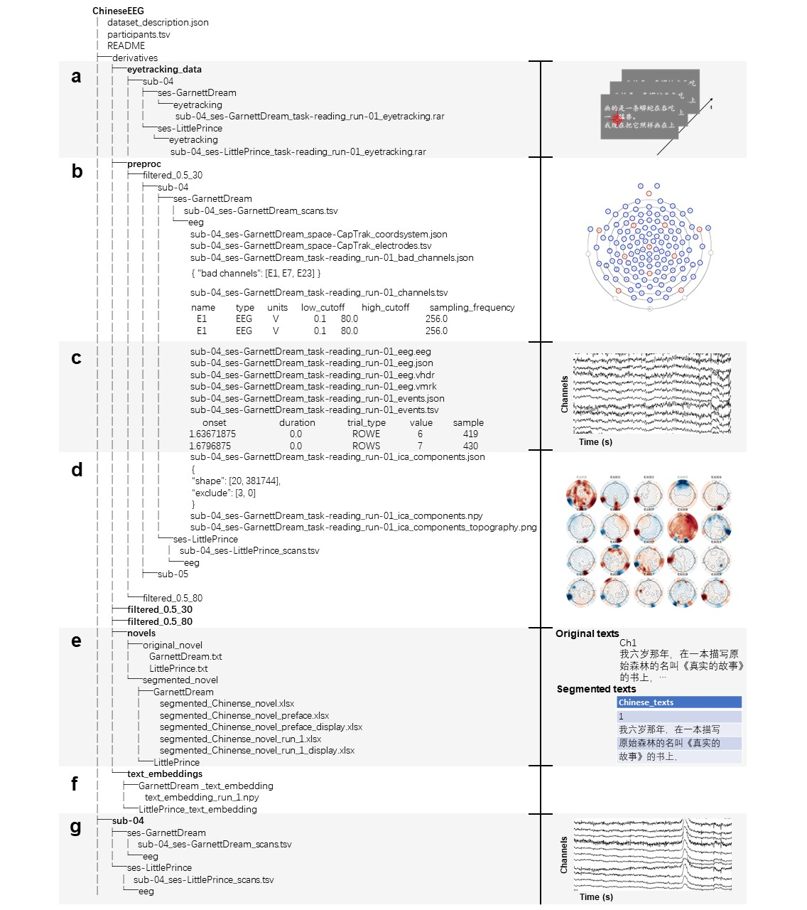
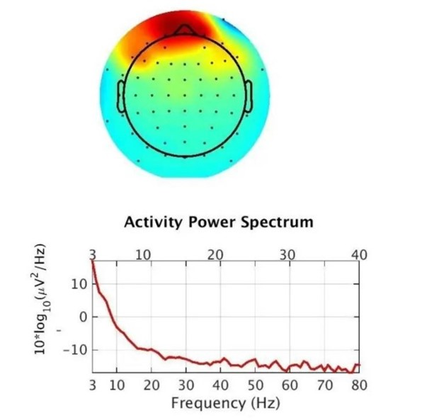
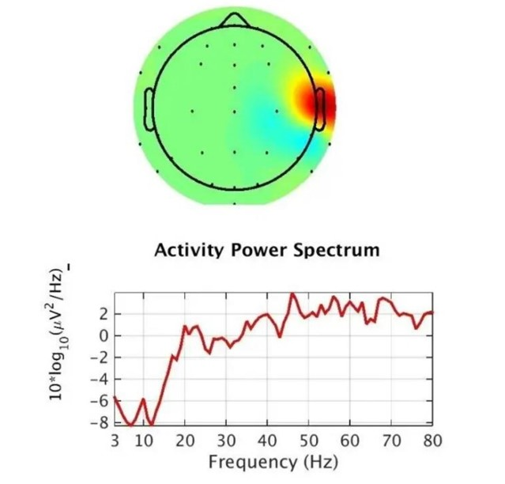
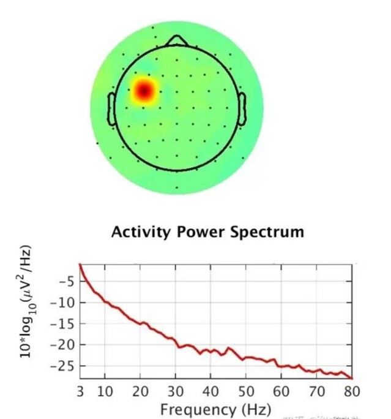
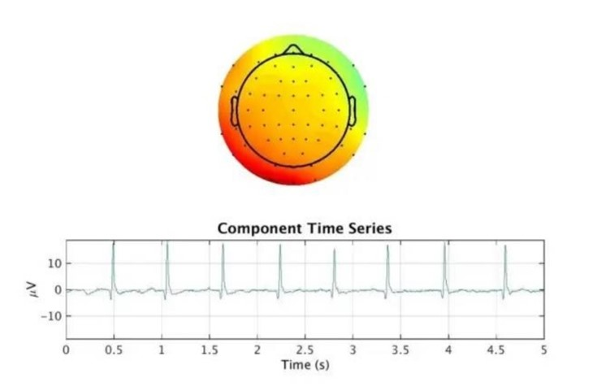

# EEG Processing Document

This document illustrates the pipeline of our EEG pre-processing and how to use our code to deal with the EEG data. Besides, an explanation of our dataset is provided for your reference.

For now, we have already recorded EEG data of 10 subjects, each data contains a nearly 12 hours long time. 

We upload a folder called `example-dataset`, which shows the structure of our dataset, which follows the BIDS standard format.

本项目受到天桥脑科学研究院MindX数据支持计划的部分资助（共计伍万元）。
其余资助来源:澳门科学技术发展基金项目(FDCT)

##  Pipeline

### Experiment and EEG Recording

Our EEG recording and pre-processing pipeline is as follows:


### Data Processing


Here, we pre-process our data to remove obvious artifact to the least extent. Our processing procedure includes these steps:

#### Data Segmentation

We will remain a short time period before and after the valid time range. We will locate the cutting position by referencing the EEG mark. Detailed information can be seen in the method `cut_single_eeg` in `preprocessing.py`. In our procedure, we set the remaining time before the valid range to 10s.

#### Resample and Notch filter

Before we do ICA, we will first follow some basic steps, including down-sampling the data and filter the line frequency. In our setting, we assign the resample frequency to 256 Hz and line frequency to 50 Hz.

####  ICA

We use ICA to remove ocular artifact, cardial artifact, muscle movement artifact and other possible artifact. In our own processing, we set the parameter  `n_component` to 15 to make sure we can find all possible artifact. We use `infomax` algorithm. You can change these parameters on your own. Details about how to change parameters will be explained in the Code part.

#### Filtering

We will filter the data using a band pass filter to remove artifact. In our processing, we set the pass band to 0.1-80 Hz

#### Bad Channel Interpolation and Bad Segment Mask

Then we will  interpolate the bad channel using method implemented in the `MNE` package. We will also mark segments which look like a bad segment with label 'bad' for reference. This can be done in GUI, which we will explain later.

#### Re-reference

Lastly, we will re-reference our data. In our implementation, we use the 'average' method.

 ## Code

### Environment Requirement

package `MNE` , `numpy` and `mne-bids` are required. You can get these three packages using the following commands:

``` 
pip install "mne>=1.0" matplotlib mne-qt-browser
```

```
pip install numpy
```

```
pip install --upgrade mne-bids[full]
```

Make sure that the `mne-qt-browser`  is installed, otherwise you can not using the GUI of the MNE methods correctly. For more information, you can turn to these pages: https://github.com/mne-tools/mne-qt-browser, https://github.com/mne-tools/mne-qt-browser, https://mne.tools/mne-bids/stable/install.html.

### Code Usage

In the code `preprocessing.py`, you can change the given parameters to pre-process the data with your own setting and **save the raw data and the pre-processed data in BIDS format**.

This code will first cut the eeg data. A short time will be remained before the start of the valid EEG segment. You can assign the time using the parameter `remaining_time_at_beginning`. After cutting, the code will run the main pre-processing pipeline. In the whole pre-processing procedure, there GUI stages will appear. The first one shows all the ICA component sources. You can exclude ones you want to drop by clicking the components. The second one shows the band pass filtered data. In this stage, you can select bad channels by clicking the channel as in the first stage. You can also mask possible bad segments of the data by annotating them with label 'bad'. The last stage will show the data after re-reference, which is the last step of the pre-processing. In this stage, you can inspect whether the pre-processed data meets your need.

The detailed information about the parameters are shown below:

| Parameter                   | type  | Explanation                                                  |
| --------------------------- | ----- | ------------------------------------------------------------ |
| eeg_path                    | str   | data path of the unprocessed eeg                             |
| sub_id                      | str   | a string of the id of the subject. Pad 0 if the id has only one digit. |
| ses                         | str   | a string describing the session of the current data. It will be contained in the file name when saving the file. |
| task                        | str   | a string describing the task of the current data. It will be contained in the file name when saving the file. |
| run                         | int   | an integer standing for the run number of the data.          |
| raw_data_root               | str   | the path of your raw data, which is also the root of the whole dataset. |
| processed_data_root         | str   | the path of your pre-processed data.                         |
| raw_extension               | str   | the file extension when saving the data, can be '.fif', '.edf', '.set' |
| dataset_name                | str   | name of the dataset, which will be saved in the dataset_description.json. |
| author                      | str   | author of the dataset.                                       |
| line_freq                   | float | line frequency of the data. This is needed when saving the data into BIDS format.                   Default to be 50. |
| start_chapter               | str   | a string which is the eeg mark of the first chapter in current eeg data. e.g. if your eeg starts with chapter 1, then the argument should be 'CH01'. |
| low_pass_freq               | float | the low pass frequency of the filter                         |
| high_pass_freq              | float | the high pass frequency of the filter                        |
| resample_freq               | float | the resample frequency of the filter                         |
| remaining_time_at_beginning | float | the remaining time before the start of the valid eeg segment |
| montage_name                | str   | the montage of the eeg                                       |
| ica_method                  | str   | which ica_method you want to use. See mne tutorial for more information |
| ica_n_components            | int   | how many ICA components you want to use. See mne tutorial for more information |
| rereference                 | str   | re-reference method you want to use                          |

## Dataset 

### Equipment

We use the following device in our experiment:

EGI: 128-channel (montage: GSN-HydroCel-128)

eyetracker: Tobii Glass 3

### Description

Our dataset consists of three main parts. The first part is the raw EEG data. The second part is the pre-processed data, which is in the derivative folder. The third part is our eyetracking record when recording the EEG signal.

The data is formatted under the requirement of the BIDS standard format. The detailed format of our data structure is shown as follows:



Here is a summary of the main components of this dataset and the significance of related files. files named as "sub-xx" in the root directory contains the raw eeg data and the eyetracking data, while "sub-xx" in the derivative/preprocessed directory contains the pre-processed data. Here we will have a detailed explanation of the pre-processed data in the derivative/processed directory:

- dataset_description.json: Provides general information about the dataset, such as its name, authors, description, and references.

- participants.json and participants.tsv: Contain participant metadata. Specifically, participants.tsv is a tab-separated values file with participant information, and participants.json is the same information in a structured JSON format.

- sub-xx/: Contains data for a specific participant.

- ses-xx/: Corresponds to a specific session (e.g. ses-LittlePrince) for a subject.

- eeg/: Contains EEG data for the participant during the session.

- sub-xx_ses-xx_scans.tsv: This TSV (tab-separated values) file contains information about the scans or recording sessions for the subject during the Little Prince session.

- sub-xx_ses-xx_space-CapTrak_coordsystem.json: This JSON file describes the coordinate system used for EEG electrode placement, possibly in the CapTrak system.

- sub-xx_ses-xx_space-CapTrak_electrodes.tsv: This TSV file provides information about the EEG electrodes used during the session.

- sub-xx_ses-xx_task-xx_events.json and sub-xx_ses-xx_task-xx_events.tsv: These files describe events or stimuli that occurred during the EEG recording session.

- sub-xx_ses-xx_task-xx_run-xx_desc-preproc_bad_channel.json: This JSON file contains information about channels that  have been identified as "bad" during pre-processing.

- sub-xx_ses-xx_task-xx_run-xx_desc-preproc_channels.tsv: This TSV file provides details about the EEG channels, including their names and properties.

- sub-xx_ses-xx_task-xx_run-xx_desc-preproc_eeg.fif: This is a file containing preprocessed EEG data in FIF format.

- sub-xx_ses-xx_task-xx_run-xx_desc-preproc_eeg.json: This JSON file describes the parameters in the EEG data.

- sub-xx_ses-xx_task-xx_run-xx_desc-preproc_ica_component.json and sub-xx_ses-xx_task-xx_run-xx_desc-preproc_ica_component.npy: These files contain information and data related to independent component analysis (ICA) components. The .npy file contains all the ICA components in a numpy array, while the .json file contains information about the shape and the excluded components of the ICA components.


In our experiment, In the "LittlePrince" session, "run-01" corresponds chapter 1-4;  "run-02" corresponds chapter 5-8;  "run-03" corresponds chapter 9-12;  "run-04" corresponds chapter 13-16;  "run-05" corresponds chapter 17-20;  "run-06" corresponds chapter 21-24;  "run-07" corresponds chapter 25-27. In the "GranettDream" session, each "run-N" corresponds to chapter N.

our derivative data is pre-processed under these settings of the parameters:

| Parameters                      | setting          |
| ------------------------------- | ---------------- |
| low_pass_freq (Hz)              | 0.1              |
| high_pass_freq (Hz)             | 80               |
| resample_freq (Hz)              | 256              |
| remaining_time_at_beginning (s) | 10               |
| montage_name                    | GSN-HydroCel-128 |
| ica_method                      | infomax          |
| ica_n_components                | 15               |
| rereference                     | average          |

### Processing Record 

Here we have a detailed record of our processing of each eeg data **(just an example now !!!)**

| subject | session | bad channels    | bad ICA components | bad segment ratio |
| ------- | ------- | --------------- | ------------------ | ----------------- |
| 06      | 1       | 17, 25, 48, 119 | 000, 004, 006      | 15%               |


### Standard

Criteria for bad channel selection：

- Equipment-related bad channels: For example, broken connections or inability to reduce impedance (as described in the experimental records)

- Noise level: Large segments of high-frequency noise and interference, occupying more than 70% of the signal.

 

Criteria for bad segment selection：

- Motion artifacts: Drift in the EEG signal caused by head or body movements, such as eye blinks, eye movements, drift, etc.

- Noise level: Presence of large segments of high-frequency noise and interference in the bad segment, with noise occupying more than 80% of the signal.

- Electrode looseness or detachment: Decreased signal quality due to electrodes detaching from the scalp, for example, significant changes in signal amplitude or sudden abnormal high or low impedance.


 ICA (Independent Component Analysis) screening criteria:

Typical features include:

1. Eye artifacts

   

   2.Muscle artifacts

   

  3.Channel noise

   

  4.Cardiac activity

   

